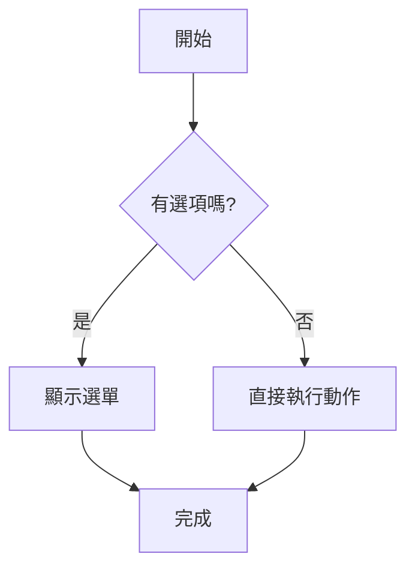

You:
請你生成一份mardown格式的文件
我要測試我的mardown的render有多少功能。

ChatGPT:
好的 👍\
以下是一份完整測試 Markdown 功能的文件，涵蓋幾乎所有常見語法與延伸語法（如表格、代辦清單、代碼區塊、數學公式、HTML、註腳、折疊區域等）。

---

````markdown
# 🧪 Markdown Render 測試文件

## 1️⃣ 標題層級
# H1 標題
## H2 標題
### H3 標題
#### H4 標題
##### H5 標題
###### H6 標題

---

## 2️⃣ 強調與行內樣式
**粗體**
*斜體*
***粗斜體***
~~刪除線~~  
<ins>底線 (HTML)</ins>  
<mark>標記文字</mark>  
`行內代碼`  
<small>小字</small>

---

## 3️⃣ 清單
### 無序清單
- 項目 A
  - 子項目 A1
  - 子項目 A2
- 項目 B

### 有序清單
1. 第一
2. 第二
   1. 第二之一
   2. 第二之二

### 代辦清單
- [x] 已完成項目
- [ ] 未完成項目
- [ ] 部分完成項目

---

## 4️⃣ 連結與圖片
[前往 Google](https://google.com)


---

## 5️⃣ 區塊引用
> 這是一段引用文字。
>> 這是巢狀引用。

---

## 6️⃣ 程式碼區塊

### Python
```python
def greet(name):
    print(f"Hello, {name}!")

greet("World")
```
````

### JavaScript

```js
const sum = (a, b) => a + b;
console.log(sum(2, 3));
```

---

## 7️⃣ 表格

| 名稱 | 類型 | 備註    |
| -- | -- | ----- |
| 貓  | 動物 | 可愛    |
| 狗  | 動物 | 忠誠    |
| 人  | 智人 | 思考的生物 |

對齊示範：

| 左對齊 |  置中 | 右對齊 |
| :-- | :-: | --: |
| aaa | bbb | ccc |
| ddd | eee | fff |

---

## 8️⃣ 分隔線

---

---

---

---

## 9️⃣ 註腳

這是一句有註腳的文字[^1]。

[^1]: 這是註腳的內容。

---

## 🔟 折疊區域 (details)

<details>
  <summary>點我展開內容</summary>

這是折疊的內容，可用於 FAQ 或說明文件。

- 支援 Markdown
- 支援多層嵌套

</details>

---

## 1️⃣1️⃣ 圖表／Emoji／符號

✅ ❌ ⚠️ ⭐ 💡\
📘 📗 📕\
→ ← ↑ ↓\
⏰ ⛔ ☕\
❤️‍🔥 💀 🧬

---

## 1️⃣2️⃣ 數學公式 (LaTeX)

行內公式：$E = mc^2$

區塊公式：
$$
\int_a^b f(x)\,dx = F(b) - F(a)
$$

矩陣：
$$
\begin{bmatrix}
1 & 0 \\
0 & 1
\end{bmatrix}
$$

---

## 1️⃣3️⃣ 任意 HTML 測試

<div style="background:#f0f0f0; padding:10px; border-radius:8px;">
  <b>HTML區塊</b> 可以直接使用。  
  <i>斜體</i>、<u>底線</u>、<span style="color:red;">紅字</span>。
</div>

---

## 1️⃣4️⃣ 引用語法測試

`>`, `*`, `_`, `#`, `[]()`, `` 都應正確渲染。

---

## 1️⃣5️⃣ 多層列表 + 代碼組合

- A
  - A1
    ```json
    { "key": "value" }
    ```
  - A2
- B
  - B1

---

## 1️⃣6️⃣ 水平混排測試

文字、粗體、斜體、`code`、[連結](#)、~~刪除~~、:smile:

---

## 1️⃣7️⃣ 引用區塊內含代碼

> 範例：
>
> ```bash
> npm install
> npm run build
> ```

---

## 1️⃣8️⃣ 行內 HTML 混合 Markdown

<div>
  **粗體區塊內文**
  <br>
  _這是斜體_
  <br>
  <a href="https://example.com">超連結</a>
</div>

---

# 🧭 Mermaid 圖表測試

## 1️⃣ 流程圖 (Flowchart)

